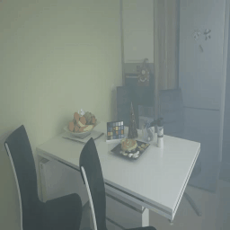

# BPPNet : Back Projected Pyramid Network

[Ayush Singh](https://www.linkedin.com/in/ayush-singh-51a375187/) &nbsp;&nbsp; [Ajay Bhave](https://www.linkedin.com/in/lusiferajay/) &nbsp;&nbsp; [Dr. Dilip K Prasad](https://www.linkedin.com/in/dilip-prasad-3b96567/)

This is the official implementation of our ECCV 2020 Workshop paper **Single image dehazing for a variety of haze scenarios using back projected pyramid network**.

Image dehazing refers to procedures that attempt to remove the haze amount in a hazy image and grant the degraded image an overall sharpened appearance to obtain a clearer visibility and smooth image. It has application in various fields such Outdoor Video surveillance, Driver assistance systems, etc.

We have implemented the network in pytorch

## Experimental Details
### Dataset used
We have trained and tested our 4 datasets named **I-Haze**, **O-Haze**, **Dense haze** and **NTIRE2020 Non Homogenous Dehazing** dataset

### Training Details
The initial learning rate for both generator and discriminator was 0.001.  The learning rate was decreased manually as the training proceed and the final learning rate for both generator and discriminator was 0.000001.

## Results

The results of our model were quite good. As we can see from the below tables that our method clearly outperformed the state of the art with respect PSNR and SSIM both. Our model does the dehazing task in real-time at an average running time of **0.0311 s** i.e. **31.1 ms** per image. 

### I-HAZE

| Metric    |    Input    |   CVPR’09   |   TIP’15    |    ECCV’16  |    CVPR’16    |    ICCV’17  |    CVPRW’18  |    Our model      | 
| :---:     |    :----:   |   :---:     |   :---:     |    :----:   |    :---:      |    :---:    |    :----:    |    :---:          |
| SSIM      |   0.7302    |   0.7516    |   0.6065    |    0.7545   |    0.6537     |    0.7323   |    0.8705    |    **0.8994**     |
| PSNR      |   13.80     |   14.43     |   12.24     |    15.22    |    14.12      |    13.98    |    22.53     |    **22.56**      |

### O-HAZE

| Metric    |    Input    |   CVPR’09   |   TIP’15    |    ECCV’16  |    CVPR’16    |    ICCV’17  |    CVPRW’18  |    Our model      | 
| :---:     |    :----:   |   :---:     |   :---:     |    :----:   |    :---:      |    :---:    |    :----:    |    :---:          |
| SSIM      |   0.5907    |   0.6532    |   0.5965    |    0.6495   |    0.5849     |    0.5385   |    0.7205    |    **0.8919**     |
| PSNR      |   13.56     |   16.78     |   16.08     |    17.56    |    15.98      |    15.03    |    24.24     |    **24.27**      |

### Dense Haze

| Metric    |    CVPR’09  |   Meng et. al  |   Fattal et. al |   Cai et. al |   Ancuti et. al  |   CVPR’16  |   ECCV’16  |   Morales et. al  | Ours model      | 
| :---:     |    :----:   |   :---:        |   :---:         |   :----:     |   :---:          |   :---:    |   :----:   |   :---:           |  :---:          |
| SSIM      |    0.398    |   0.352        |   0.326         |    0.374     |    0.306         |    0.358   |    0.369   |    0.569          |  **0.613**      |
| PSNR      |   14.56     |   14.62        |   12.11         |   11.36      |    13.67         |    13.18   |    12.52   |    16.37          |  **17.01**      |

### NTIRE2020 Non Homogenous Dehazing
As **NTIRE2020 Non Homogenous Dehazing** is very new dataset and its ground truth for validation and test data was not available, we were not able to compare it on the other state of the art. We randomly selected 5 images from training as testing images and trainined our model on the rest 40 images. The PSNR and SSIM for that testing data were **19.40** and **0.8726** respectively

### Few of our results
 &nbsp; &nbsp; &nbsp; &nbsp;  &nbsp; &nbsp; &nbsp; &nbsp; 

